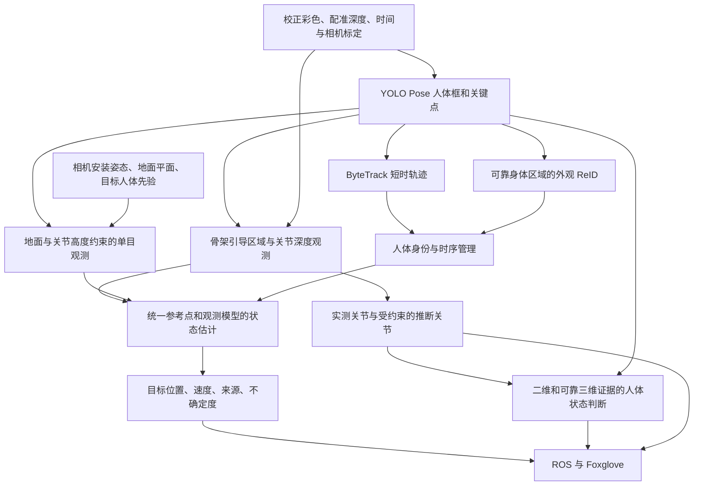

# C 方案多源人体感知融合设计

记录日期：2026-10-02。状态：整体为讨论方案与实施建议；第一阶段骨架辅助真实深度融合和第二阶段单目接地点定位（独立输出，未与 RGB-D 融合切换）已实现并通过本机软件专项验证，可选ReID身份观察层及连续确认后的锁定恢复已实现；2026-10-04 继续实现统一接地点与三维状态增强（见《方案C统一定位与三维姿态》）；现有实现与验证范围见 [方案C实现与验收](方案C实现与验收.md)。

## 1. 目标与当前事实

围绕四个问题完善 C：近距离深度空洞下的人体定位；超出有效深度范围后的单目定位；遮挡和交叉后的目标身份恢复；三维证据辅助人体状态和跌倒判断。

- C 当前使用 Gemini RGB-D、YOLO26s-pose、ByteTrack，并继承 B 的选人、锁定、目标测距、三维卡尔曼和接口。
- B 及原 C 的目标测距检查人体框内躯干、头肩、下半身、左右侧五个候选区域。第一阶段 C 增加肩髋/膝踝深度与骨架躯干区域，五区域保留作支持和兜底；不是只采样躯干。框比例区域不等同解剖分割。
- C 为每个二维关节点独立采样 7×7 深度邻域；可靠关节输出三维坐标，缺失关节为 NaN。当前姿态状态机使用二维关键点、人体框和时序；三维骨架尚未用于状态判定。
- 用户报告当前深度可用范围约 3 m；这是待分场景验证的工作范围，不据此宣称设备官方最大量程为 3 m，也不按 3 m 硬切换算法。
- Gemini 的物理配准、相机安装外参、地面标定和真人状态验收仍待完成。当前工作不改变小车运行、项目默认 B 入口或跌倒只检测显示的边界。

## 2. 两篇起点论文

1. [Human Following in Mobile Platforms with Person Re-Identification](https://arxiv.org/abs/2309.12479)，2023：多角度目标注册，脸部/躯干外观 ReID 与运动跟踪。骨架帮助裁剪身体区域，不是仅靠骨骼比例识别人。
2. [Robot Person Following Under Partial Occlusion](https://medlartea.github.io/files/mono_rpf_track.pdf)，ICRA 2023；[作者代码 Mono-RPF](https://github.com/MedlarTea/Mono-RPF)：已知相机/地面关系、站立人体关节高度先验，可见关节参与地面位置估计及 UKF 更新。原方法初始化要求完整人体；站立高度先验不适合直接恢复坐蹲/跌倒骨架。代码基于 ROS 1，需要移植而非直接加载到 Humble。

这两篇不是本次后续检索所要求的“CCF A 类期刊”候选，保留为直接相关的工程起点。第二篇估计地面位置/速度，不是完整的自由姿态三维骨架。

## 3. 统一估计流程（拟实现）

框架统一处理观测；目标代表位置与每个关节仍各自输出。不能把不同身体部位的坐标无差别平均，也不能把躯干表面点与脚下地面点直接作为同一观测送进滤波器。

## 4. 近距离：骨架引导 RGB-D 融合

第一阶段已实现真实深度联合采样与关联，当前代表点选择框中心射线＋人体深度，不实现下述骨盆/地面偏移模型；缺失关节不推断。参数、行为变化及验证边界见 [实现与验收](方案C实现与验收.md)。

以可靠肩、髋确定随姿态变化的躯干采样区域，沿可见肢体增加候选区域；保留 B 多区域采样作为骨架缺失时的补充。共同使用有效深度比例、深度离散度、前后景分离、关键点置信度和时间一致性筛选。

先定义目标参考点与身体部位偏移的观测模型，再融合；建议以骨盆/躯干中心和对应地面位置分别建模。只在模型条件成立时相互转换。多区域和关节使用同一深度图，观测相关，不能当作完全独立测量重复增加置信度。

完全没有深度的关节不成为真实测量。可通过骨长、时序或后续三维姿态模型推断，但必须带独立来源和不确定度，不覆盖原始观测。

## 5. 远距离：地面反投影及关节高度先验

脚部接地点可靠时，用校正后的像素射线与地面求交。脚不可见、人体仍站立且已有该人的关节高度先验时，使用肩/髋等射线与对应高度平面求交，转换为人体地面位置。近距离可靠 RGB-D 可用于初始化个体先验，这是对原论文的工程扩展。

需先确认相机到车体外参、相机离地高度、地面法向和时间同步；车辆运动时需处理姿态变化和坐标变换。只有关节接近地面时才能把关节射线直接与地面相交，踝关节本身不等于精确的鞋底接地点。

采用有符号射线平面交点，拒绝平行/近似平行、负距离、过大不确定度和不成立的支撑假设。坐蹲、弯腰、跌倒时停止使用固定站立高度；坡道和台阶不沿用旧地面平面。远处误差随像素、标定及姿态误差放大，不承诺超出验证距离的精度。

信息源选择基于质量并带迟滞：RGB-D 可靠时优先使用；几何条件满足时增加单目观测；均不可靠时短时预测，超时失效。预测不能刷新真实测量年龄。

## 6. ID：短时轨迹与目标身份分层

保留 epoch:track_id 作为跟踪器标识，新增独立目标身份及其与当前轨迹的关联。结合框/运动/空间门控、可见骨架一致性与躯干外观 ReID；人脸可作为可选证据，不要求跟随目标一直朝向相机。

目标注册和外观库更新只接受高置信度、低遮挡、无身份歧义样本；多人交叉或遮挡期间冻结更新。重新绑定需连续多帧确认及与其他候选的差距，宁可保持身份未知也不强行换人。长间隔恢复身份不拼接成连续跌倒过程，跟踪器 epoch 改变仍中断动作时序。

## 7. 状态：二维与三维证据结合

有真实深度支持时增加肩髋相对重力倾角、骨盆/肩部离地高度、垂直下降速度、膝角及持续时间；只计算支持关节足够的特征。相机运动需补偿，不能将车辆俯仰造成的图像下降当作跌倒。

无深度时保留二维规则；只有地面位置不足以恢复全身三维关节。若新增时序三维姿态模型，应区分根节点相对姿态、绝对米制位置、模型推断和 RGB-D 实测，验证跌倒/躺卧等域外动作。

禁止以“站立关节高度不变”恢复骨架，再用该骨架证明人体仍站立；禁止使用预测关节补出确定跌倒事件。保持静态躺卧不补报跌倒、遮挡断流中断连续计时的契约。

## 8. 接口与验证建议

新状态需包含：reference_point、frame、observation_stamp、真实测量年龄、position_source（depth/ground/model/predicted）、协方差或可靠性、关节逐点来源和有效性、身份匹配置信度。字段设计需要兼容现有 TargetState；不能仅将估计值写入 position_valid 就宣称已满足旧接口语义。

实施顺序：

1. 标定与记录：确认真实配准、安装姿态、地面及不同距离/材质的深度有效比例。
2. 骨架引导采样：对照当前 B/C，比较位置误差、跳变和有效输出比例。
3. 单目定位：先可见接地点，再关节高度先验；验证边界、坡道/坐蹲退出及 RGB-D 恢复时的切换。
4. 身份恢复：测试交叉、遮挡、转身、离场重返和相似衣着；记录误绑定、ID 切换及恢复延迟。
5. 三维状态：使用录像或安全受控动作，评估误报/漏报、触发延迟、断流恢复和初始躺卧。

所有阶段做消融：B 基线、仅骨架引导深度、加几何、加 ReID、加三维状态。Jetson 端实测吞吐、延迟、内存及与现有模块并行负载；论文硬件或 Mac 指标不能作为 Jetson 性能。

## 9. 后续文献评估

用户要求进一步查找 CCF A 类期刊及相关 GitHub 项目。检索结果见 [方案C文献与开源项目评估](方案C文献与开源项目评估.md)，已核验期刊类别、发表版本、作者项目关联和工程适配边界；未运行的代码不得记录为验证通过。本文保存讨论阶段的设计，研究所得的具体候选、源码风险和实施优先级以评估文档为补充。
