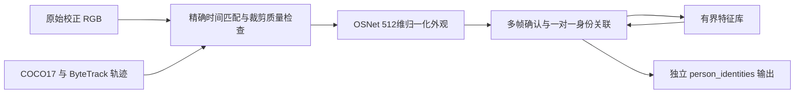

# C 身份 ReID 接入与验收

日期：2026-10-03。状态：会话内身份观察层与可选身份锁定恢复已实现。观察层模型验证已完成；锁定恢复的软件验收见下文。现场多人/遮挡准确度和 Jetson 性能尚未验收。两个开关分别默认关闭，不转移身高先验，不启动车辆。

## 两层 ID 与范围

`epoch:track_id` 仍由 ByteTrack 产生。ReID 增加 `会话随机前缀:person_0001` 等身份，并维护它与当前轨迹的关联。新轨迹只有在连续多个有效外观观测通过时才能接回旧身份。身份仅表示外观匹配假设，不识别真实姓名，不保证唯一生物身份。



- 新人注册默认需3次一致的采样，采样上限5Hz；不是每帧无条件注册。缺点、模糊、多人重叠、低检测置信度及退化躯干几何暂停采样。
- 当前用完整人体框提取OSNet特征；骨架用于检查可见性/裁剪质量，不把它包装成部位训练的网络或骨骼比例身份识别。需要双肩双髋有效及至少6个可见点；在已跟踪人体框之间检查重叠。尚未利用未跟踪检测框、分割掩码或人脸。
- 每次采样也检查已有映射；同一ByteTrack编号出现矛盾外观，立即停止输出已确认关联，不先把新外观混进旧特征库。
- 新轨迹需同时满足距离门槛、与次佳身份的间隔、与其他当前轨迹竞争同一身份的间隔，以及一对一占用约束。没有充分证据就输出PENDING/AMBIGUOUS，不强行选最近的人。
- 已绑定但因遮挡而无法核验的可见轨迹，保留身份占用，防止旁人趁低质量期间借走；恢复质量后需要重新多帧确认。身份本人不再出现时才释放轨迹占用。
- 特征库保留初始注册中心，在线更新不能漂移该中心；只加入与身份非常一致的高质量观测。每人最多8个样本，最多64个身份，失去有效观测30秒后过期。内存中保存特征，不持久化到硬盘；节点重启建立新会话。
- ByteTrack换epoch不会按数字ID直接继承身份；只能重新凭外观确认。断流超过max_gap_s会清除当前关联并重新确认，时间倒退清空身份库，身份编号不复用。
- 本阶段不使用未经运动补偿的位置门控，不以深度是否有效作为身份识别前提。位置融合后可以再接入共同坐标系门控。上游Pose当前仍使用现有RGB-D入口；这次没有新增RGB-only采集路线。

## 模型与来源

使用 [作者 Torchreid Model Zoo](https://github.com/KaiyangZhou/deep-person-reid/blob/f8cd150fdf77e8d9e1ed143b7f308c2c609ded50/docs/MODEL_ZOO.md) 的 **OSNet-x0.25 / MSMT17 同域 ReID 权重**，不是该表前半部的ImageNet预训练权重；不套用OSNet-AIN或完整大模型的论文指标。

- 作者架构源码固定提交 `f8cd150fdf77e8d9e1ed143b7f308c2c609ded50`，未经修改放在 `yolo_person_tracker/vendor/osnet.py`。MIT原许可证与源码哈希随包保留。
- checkpoint：`osnet_x0_25_msmt17.pth`，3,057,863字节，下载自作者Model Zoo所链接的Google Drive，SHA-256 `6f57607fed9f502b9efed546108132ee715df5a5b6e6932c6269bacb47f59f99`。哈希是本次取得文件后记录的固定校验值，不声称作者另外发布了签名。
- 本机导出ONNX：891,011字节，RGB 256×128、ImageNet均值/标准差、输出512维特征后L2归一化。运行使用OpenCV DNN CPU，不依赖运行时Torchreid/GDrive，不自动下载或切换其他模型。模型与同名`.onnx.json`校验文件必须一起准备。
- 权重与ONNX在忽略的模型目录中；来源/哈希另记入版本控制中的`models/manifest.json`。代码MIT许可保留；模型及训练数据的使用条件以作者/数据集说明为准。

本机复用已有`.venv`的PyTorch，补装onnx 1.17.0用于显式导出；没有新建大型环境。

```bash
# 已有兼容 torch/onnx 的 Python 环境中运行；首次需要下载时显式 --download：
.venv/bin/python scripts/prepare_reid_model.py --download
# 仅本地 checkpoint 导出，不联网下载：
.venv/bin/python scripts/prepare_reid_model.py
```

导出会以真实PyTorch权重与OpenCV输出对比；缺文件、哈希不符、缺必要依赖会报错，不产生“已验证”的替代模型。

## 启用与观察

在已构建且已有相机输入的环境，C route新增 `reid_observer`；默认`reid_enabled=false`，不加载模型、不订阅RGB。沿用当前C采集、模型和标定参数，额外加入：

```bash
ros2 launch perception_bringup perception.launch.py route:=yolo_pose \
  model_path:=/absolute/yolo26s-pose.pt \
  color_topic:=/camera/color/image_rect \
  depth_topic:=/camera/aligned_depth_to_color/image_raw \
  camera_info_topic:=/camera/color/camera_info_rect \
  reid_enabled:=true \
  reid_model_path:=/absolute/osnet_x0_25_msmt17.onnx
```

若使用现有C一键入口，在满足原相机/模型条件的Jetson环境设置：

```bash
REID_ENABLED=true \
REID_MODEL_PATH="$PWD/models/weights/osnet_x0_25_msmt17.onnx" \
bash scripts/start_c.sh
```

本轮没有在小车执行上述启动。`REID_CONFIG` / `reid_config` 可指定配置文件；启动开关与模型路径来自上述环境变量/launch参数。其他阈值见 `ros2_ws/src/perception_bringup/config/reid.yaml`，均为初始值，需现场验证。

`/perception/person_identities` 输出 PersonIdentityArray：精确保留RGB观测header、有效性、处理耗时、观测年龄，以及各轨迹的持久身份、核验状态、可见性、余弦距离和原因。距离不是匹配概率；未确认时person_id为空。失踪身份会以track_id为空、verified=false、visible=false、state=LOST列出，**不包含位置**。断流/过期/模型错误输出valid=false空列表；不把过期结果赋予新时间。

RGB与Pose使用精确时间及frame匹配（Pose继承原RGB时间），不使用缩放后的预览图。最多缓存20组消息、单推理worker、最多8人，忙时丢弃新任务而非积压；过期结果拒绝，错误不会阻塞状态心跳。模型缺失只让独立身份层报错，原C跟踪链路仍可运行。

Foxglove `c-layout.json` 提供身份RawMessages面板。TargetState.target_id仍是当前epoch:track_id，身份映射在person_identities查看；persistent ID不会写入ground的个体确认参数。

## 验证与限制

- 纯逻辑：注册、换轨迹恢复、同轨迹换人、多人竞争、相似新人拒绝、质量冻结、长期占用、双人交换、容量/TTL、时间倒退、epoch、图库不漂移及特征维数检查。
- ROS：精确RGB/Pose配对、缺模型、身份恢复、矛盾/低质量/模拟输入拒绝、断流、阻塞worker心跳与过期完成丢弃，无目标/运动输出。测试使用显式合成descriptor，不能作为实际ReID精度。
- 真实模型：PyTorch→ONNX/OpenCV归一化特征最大差约 `1.9e-7`；Mac与Linux ARM64 Humble/OpenCV 4.5.4在真实照片裁剪上的最大特征差小于 `3.1e-7`。
- 真实照片采用本机Ultralytics官方bus.jpg。原整图4人因重叠/躯干缺点全部被质量规则拒绝，这个结果保留。另取2个独立人体裁剪验证模型和ROS链路，特征间距约0.463；重复同一裁剪并人为换track ID能够接回，换成另一人的裁剪会拒绝继承。**这是受控静态图验证，不是真实遮挡、多人交叉或跨视角准确率**，没有为样例通过而放宽质量门槛。
- Mac两次单裁剪CPU调用约12.4/5.4ms，Mac承载的ARM64容器约6.9/3.5ms；只有少数调用，既不是稳定帧率测评，也不是Jetson性能。
- 待现场验证：真实遮挡恢复、相似衣着误认、视角/光照变化、误报/漏报及重新确认时延；保守质量规则可能频繁不输出。无外观证据时不保证恢复；当前不支持跨节点重启的长期身份。

可复现命令：

```bash
# 真实模型与本地公开示例图（该路径依本机Python版本而定）：
.venv/bin/python scripts/smoke_reid_model.py \
  --image .venv/lib/python3.12/site-packages/ultralytics/assets/bus.jpg
bash scripts/test_reid_model_container.sh
ROSCAR_C_TEST_LOG="$PWD/artifacts/c-reid-final.log" bash scripts/test_c_container.sh
```

证据：`artifacts/reid-export.log`、`reid-smoke/report.json`、`reid-arm64-model.log`、`reid-unit-final.log`、`c-reid-final.log`；最终测试数量与退出码以WORKLOG为准。

## 可选身份锁定恢复（2026-10-03）

在原C入口额外设置 `REID_ENABLED=true REID_LOCK_ENABLED=true`，或launch同时设置 `reid_enabled:=true reid_lock_enabled:=true`。缺少观察层开关时，组合launch明确拒绝；缺模型/无有效身份时，身份锁定保持LOST，不回退邻框接续。默认不启用，B和原C行为保留。

- lock_target仍选择画面中央轨迹，auto_lock_single仍需单人连续出现；选定后先等待身份确认。锁定恢复模式关闭原Selection的邻框重关联、缺人保持和自动换人。
- 默认额外要求3个不同采集时间的已核验身份结果（`reid_lock_confirm_frames`，至少2）。首次建立身份、换轨迹、失效恢复均需确认；观察层自身的多帧确认仍保留，所以总延迟比单独观察层更长，需现场测量。
- 只接受本节点已输出Pose的精确RGB时间戳和frame，最近64帧有界缓存；要求轨迹属于该帧且仍在当前候选中，当前人员身份映射一对一。重复、锁定前或乱序结果不增加计数；未知header、歧义、低质量、矛盾或无效结果撤销有效位置。
- 证据期限默认0.5秒（`reid_lock_max_age_s`），按采集时间计龄；迟到推理不刷新完整期限。旧证据仍有效的短间隔可继续输出，但一旦收到否定证据立即失效。身份从采样后发生变化到下一次采样间存在不可避免的检测延迟。
- 人体消失后立即LOST。新轨迹通过确认后TargetState.target_id改为它自己的epoch:ID，位置只取该轨迹的深度与滤波结果，仍遵守原测量年龄；不搬旧坐标或旧滤波器。不改变身高先验绑定。组合入口也同步约束地面目标输出：身份锁定未确认时target_state_ground保持无效；全体人员的地面几何估计仍可独立显示。
- epoch变化保留已锁定持久身份，但清空确认和缓存，只能凭新epoch的外观结果恢复；观察层重启/图库过期无法识别旧身份时保持LOST，需要显式重锁。释放清除身份并抑制自动锁定；主动重锁建立新的确认过程。
- 这是感知选人功能，不发布速度，也未部署到小车。外观误认仍可能导致错误接续，软件规则不能代替真实多人验收。

测试入口：`tests/test_identity_lock_runtime.py` 已纳入 `scripts/test_c_container.sh`；纯逻辑 `test_identity_selection.py` 覆盖恢复、多人竞争、交叉换ID、同ID换人、释放/重锁、epoch、超时、重放及缓存边界。ROS测试使用合成检测与身份消息，不作为实际ReID准确率或相机验收。

本阶段最终软件回归：Linux ARM64 Humble 14包构建、103项感知逻辑及相关ROS回归通过，含地面目标身份门控、缺少观察层时拒绝启动；日志 `artifacts/c-identity-lock-final.log`。不计入真实场景准确率验收。
