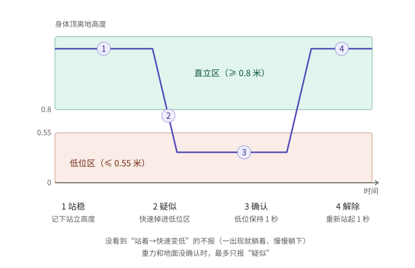
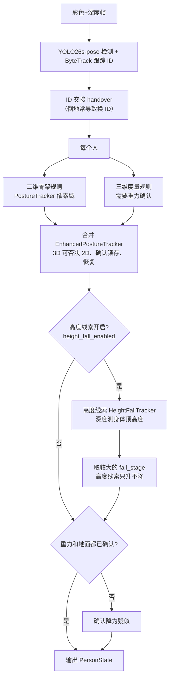

# 跌倒检测整体逻辑（C 路线，2026-10-11）

一句话：看“头顶离地多高”这条线——站稳后 2 秒内快速掉进 0.55 米以下并降了至少 0.4 米为疑似，低位保持 1 秒为确认，重新站起 1 秒解除。下文是完整细节。

本文按代码现状描述 C 路线（YOLO26s-pose + Gemini RGB-D）从一帧图像到“跌倒”输出的全部判断，供审阅。代码位置：

| 模块 | 文件 |
|---|---|
| 二维骨架规则 | `ros2_ws/src/yolo_person_tracker/yolo_person_tracker/pose.py`（`geometry2d`、`PostureTracker`） |
| 三维度量规则与 2D/3D 合并 | `pose3d.py`（`geometry3d`、`EnhancedPostureTracker`） |
| 无骨架高度线索 | `height_fall.py`（`body_heights`、`HeightFallTracker`） |
| ROS 节点组装 | `pose_node.py`（`publish_image`、`apply_height_fall`、`frame_gravity`） |
| 参数 | `ros2_ws/src/perception_bringup/config/pose.yaml` |
| 离线回放与评估 | `scripts/replay_falls.py`、`scripts/evaluate_falls.py` |

## 1. 输出与边界

- 每人每帧发布 `PersonState`：`posture`（UNKNOWN / STANDING / SITTING_CROUCHING / LYING / FALLEN）、`fall_stage`（0 无，1 **疑似**，2 **确认**）和 `detail`（判断依据）。
- 只发布状态和可视化，**不接语音、不接运动**。
- 规则是几何启发式，不是训练出来的跌倒分类器。
- **确认（2）有硬门槛**：安装方向/重力、地面没有人工确认时，最多只报疑似（1）。`*_confirmed` 开关永不自动置位。
- **静态躺卧不补报**：只有观察到“站着 → 快速变低”的过程才算跌倒；一出现就躺着的人不报。

## 2. 每帧总流程

帧级重置：相机数据过期/出错、跟踪 epoch 变化（换目标/重启跟踪）时，所有跟踪器状态清空。

## 3. 二维骨架规则（PostureTracker）

### 3.1 单帧姿态（`geometry2d`）

| 条件 | 结果 |
|---|---|
| 双肩、双髋任一置信度 < 0.5，或框无效 | 无法判断（UNKNOWN，原因写 detail） |
| 躯干（肩中点→髋中点）退化或倒置 | 无法判断 |
| 躯干与竖直夹角 ≥ 60° **且** 框宽/高 ≥ 1.2 | **躺（lying）** |
| 夹角 < 35° 且双膝可见：膝比髋低 ≥ 0.2×框高 | STANDING，否则 SITTING_CROUCHING |
| 其他 | UNKNOWN |

记录每帧的“躯干中心纵坐标”和框高，用于判断下降。

### 3.2 状态机（每个跟踪 ID）

1. **直立基线**：最近 1 s（`pose_transition_s`）内连续站/坐至少 0.3 s（`pose_stable_s`），记下当时的躯干中心和框高；基线超过 1 s 没更新就作废。
2. **疑似**：当前是躺，且躯干中心比基线低了 > 0.25×框高（`pose_drop_fraction`）→ 进入待确认，报 **1**。
3. **确认**：持续躺 1 s（`pose_lying_confirm_s`）且仍然低于基线 → `pose_upright_confirmed=true` 时报 **2**，否则保持 1。
   - 期间不再是躺、或回到基线高度 → 取消（`pose_confirm_lying_only=true` 时只要一直躺就不复查高度）。
4. **恢复**：确认后连续 STANDING 2 s（`pose_recovery_s`）才解除。
5. **缺失**：肩/髋看不到 → 默认清空所有证据；`pose_gap_pause=true` 时 0.5 s 内只暂停计时。

> 低机位下肩髋经常不可见、躺下的人常被判成站，10-09/10-10 两批录像里这套规则几乎不触发（见 §8）。

## 4. 三维度量规则（geometry3d + 度量状态机）

只在 `pose3d_enabled=true` **且** `pose3d_gravity_confirmed=true` 时启用（默认未确认 → 不启用）。

- 用真实深度的肩、髋关节点（0.2–3 m，必须解剖上合理：躯干长 0.2–0.85 m、肩/髋宽 0.12–0.8 m）。
- 躯干与重力方向夹角 → 是否水平；躯干中心离地高度 = 中心沿重力投影 + 相机高度。
- **躺**：夹角 ≥ 60° **且** `ground_confirmed` **且** 中心离地 ≤ 0.65 m（`pose3d_low_center_m`）。
- 站/坐：看大腿与竖直的夹角，≥ 45° 为坐/蹲，否则站；双膝无深度时可用二维标签代替（`pose3d_knee_fallback`）。
- 状态机与 §3.2 相同，但下降阈值换成米制 0.30 m（`pose3d_metric_drop_m`），短时缺深度（≤ 0.35 s）只暂停计时。
- 确认需要重力**和**地面都已确认。

## 5. 2D/3D 合并（EnhancedPostureTracker）

- 二维历史每帧都更新，三维历史单独保存，互不搬用基线。
- **三维否决**：地面已确认且三维判为站/坐，或躯干中心高于 0.65 m → 清掉二维的跌倒事件（低机位透视造成的假“躺”）。
- **确认锁存**：任一路确认就锁存为 FALLEN，记录来源（2d/3d）。
- **恢复**：连续 STANDING 2 s；三维来源的跌倒必须用三维证据恢复（趴向相机的人二维上可能像站着）。
- **输出等级**：取二维（未被否决时）和三维中较大的阶段。
- **动态重力**（`pose3d_up_source=floor|tf`，云台用）：本帧没有重力 → 本帧只做二维且重置二维下降基线；横滚 > 3° → 二维判为未知；相机转动 > 2° → 重置二维基线。

## 6. 无骨架高度线索（HeightFallTracker，`height_fall_enabled`，默认关）

思路：低机位下骨架不可靠，但“人框里离相机最近那层表面的最高点”离地高度能直接看出站着还是躺着。

### 6.1 单帧测量（`body_heights`）

- 框左右各缩 10%，取框内 0.3–6 m 的有效深度（≥ 150 点）。
- 只保留最近表面：深度不超过 20 百分位 + 0.6 m 的点（去掉身后背景）。
- 每点沿重力方向算离地高度（需要重力方向 + 相机高度），取 **95 百分位作为“身体顶”**。
- 框顶离图像上沿 ≤ 15 px（`height_top_edge_px`）：头可能出画，测得值只算下界——高于 0.8 m 仍可证明站立，低于则当作“未测到”。

### 6.2 状态机（每个跟踪 ID）

| 量 | 默认 | 含义 |
|---|---|---|
| `upright_min_m` | 0.8 m | 身体顶 ≥ 此值算直立 |
| `hint_upright_min_m` | 0.65 m | 骨架判 STANDING 时，≥ 此值也算直立（远处人头可能超出深度视场） |
| `low_max_m` | 0.55 m | 身体顶 ≤ 此值算低位（躺地） |
| `drop_min_m` | 0.4 m | 基线减当前 ≥ 此值才算下降 |
| `stable_s` / `transition_s` | 0.3 s / 2 s | 基线需直立 0.3 s；基线 2 s 内有效 |
| `confirm_s` | 1 s | 低位持续多久确认 |
| `recovery_s` | 1 s | 确认后直立多久解除 |
| `max_gap_s` | 0.5 s | 短缺测暂停计时；> 2 s（4 倍）没见到则重置 |

1. **直立基线**：直立持续 ≥ 0.3 s，记下身体顶中位数；超过 2 s 未更新且没有待确认事件时作废。
2. **疑似（1）**：有效基线 **且** 当前身体顶 ≤ 0.55 m **且** 比基线低 ≥ 0.4 m → 进入待确认。
   - **下蹲否决**：骨架判站/坐蹲且框高 ≥ 1.5×框宽（`veto_min_aspect`）时，低位当作下蹲，不发起、并取消待确认（躺着的人框是扁的，不受影响）。
   - **侧边**（可选 `side_edge_px`）：框贴左右边时不能发起（走出画面的人只剩一条腿）。
3. **确认（2）**：待确认后低位持续 1 s。
4. **取消**：确认前身体顶回到 0.55 m 以上 → 取消（可选 `sit_hold_s` 见下）。
5. **恢复**：确认后身体顶 ≥ 0.8 m（或骨架站立且 > 0.55 m）持续 1 s；测不到高度时，骨架站立且框高瘦也可作为恢复证据。
6. **缺测**：没有深度/被判截断的帧不当证据，0.5 s 内暂停所有计时。
7. **没有下降过程的低位**（一出现就躺着、慢慢坐下再躺）→ “静态低位”，不报。

### 6.3 ID 交接与可选项

- **交接**（需要 `pose_handover_s > 0`，默认 0 关）：倒地常让跟踪器换 ID。旧 ID 消失 1.5 s 内，若恰有一个新框与旧框水平重叠、位置不更高、底边接近，把旧状态（基线、待确认、确认）移给新 ID，缺口时间不计入证据。也接受与旧 ID 短暂重叠、刚出现且自己还没有任何证据的新 ID。
- **`height_lost_hold_s`**（默认 0 关）：已疑似/已确认的人，消失不超过该时长仍可交接（或同 ID 回来时暂停而不重置）。针对“脚朝低机位躺下，YOLO 几秒内完全检测不到”。
- **`height_sit_hold_s`**（默认 0 关）：快速下降后坐起（身体顶未回到 0.8 m）或被下蹲否决，在该时长内保持疑似；其间再躺低 1 s 即确认，站起立即取消。
- **`height_side_edge_px`**（默认 0 关）：见上，只限制“发起”，其余照常。

### 6.4 与骨架结果合成

- 高度线索的阶段**只能抬高**骨架结果（取较大），不会降低。
- 达到 2 时，若 `pose3d_gravity_confirmed` 和 `pose3d_ground_confirmed` 不都为真，降为 1，detail 注明“gravity/ground unconfirmed: suspected only”。
- 重力来源：`up_source=static` 用 `pose3d_up_*` 和 `pose3d_camera_height_m`；`floor`/`tf` 用本帧值，本帧缺失则高度线索本帧不测量。

## 7. 开关与默认值汇总

| 开关 | 默认 | 作用 |
|---|---|---|
| `pose_upright_confirmed` | false | 二维规则允许确认 |
| `pose3d_enabled` | true | 三维规则（仍需重力确认） |
| `pose3d_gravity_confirmed` / `pose3d_ground_confirmed` | false / false | 三维启用、三维和高度线索的确认 |
| `pose3d_up_source` | static | 重力来源：static / floor / tf |
| `floor_fit_enabled` | false | 深度地面拟合（仅作证据） |
| `pose_gap_pause` | false | 二维缺肩髋时暂停而非清空 |
| `pose_handover_s` | 0 | ID 交接时长（二维/三维与高度线索共用） |
| `pose_confirm_lying_only` | false | 二维确认只要求持续躺 |
| `pose3d_knee_fallback` | false | 三维缺膝时借二维标签 |
| `height_fall_enabled` | false | 高度线索 |
| `height_lost_hold_s` / `height_sit_hold_s` / `height_side_edge_px` | 0 / 0 / 0 | 高度线索可选项 |

离线评估当前最好组合：`pose_handover_s=1.5` + 高度线索 + 下蹲否决（`veto2d`，即 `veto_min_aspect=1.5`）+ `lost_hold_s=6`、`sit_hold_s=3`、`side_edge_px=8`，几何来自离线消失点估计。

## 8. 离线评估口径与当前效果

**口径**（`evaluate_falls.py`）：
- 每次跌倒的窗口：开始倒前 0.5 s 到重新站稳；窗口内出现疑似/确认的**上升沿**算检出，延迟从触垫算起。
- 反例动作窗口：动作开始前 0.5 s 到结束后 3 s；其间出现告警算误报。
- 不在任何标注里的告警算“标注外告警”。
- 同一人最后的阶段保留 1 s（跟踪 ID 交替时不重复计数）；窗口开始前就已在报警的单独标注为“延续”。

**效果**（离线回放，**非实车**；回放里确认不受重力/地面确认开关限制）：

| 数据 | 方法 | 跌倒疑似 / 确认 | 反例误报 疑似 / 确认 | 标注外 |
|---|---|---|---|---|
| 10-10（27 cm，抬头 15°，20 跌倒 / 19 反例） | 二维骨架 | 0 / 0 | 0 / 0 | 0 |
| 同上 | 高度线索最佳组合 | 18 / 17 | 2 / 1 | 0 |
| 10-09（约 0.5–0.6 m，20 跌倒 / 25 反例） | 二维骨架 | 2 / 0 | 0 / 0 | 0 |
| 同上 | 高度线索最佳组合 | 19 / 16 | 0 / 0 | 0 |

确认延迟中位约 1.7 s；倒地后检测器丢人的几次 4–6 s。

**已知漏判/误判**：
- 跪倒、瘫坐：身体顶始终 > 0.55 m，不算低位。
- 趴下且脚朝相机：YOLO 完全检测不到，疑似之前就丢人。
- 先跪后侧躺的“快速主动躺下”：高度变化与真跌倒几乎一样，会被确认。
- 慢慢坐下再躺下：按设计不报（避免日常躺下误报），因此“先坐稳再倒”的跌倒也会漏。

## 9. 请审阅的判断点

1. **阈值是否合适**：低位 0.55 m、直立 0.8 m、下降 0.4 m、确认 1 s。按成年人身高设定，儿童或很矮的人可能需要调整。
2. **“静态躺卧不补报”**是否符合使用场景：一进画面就躺着的人（例如在画面外倒下）不会报。
3. **跪倒、瘫坐不算跌倒**是否可接受，还是需要“中等高度长时间不动”的额外线索。
4. **快速主动躺下被确认**是否可接受（目前单靠高度无法区分）。
5. **确认门槛**：实车上要报“确认”，必须人工确认重力（安装/云台角）和地面；只开云台 IMU 而不确认地面，最多报疑似。
6. **默认值**：高度线索及其可选项目前全部关闭，计划在下一批独立录像上复评后再决定默认开启哪些。
